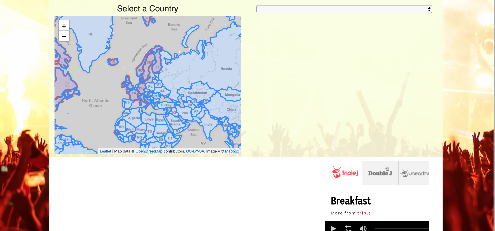
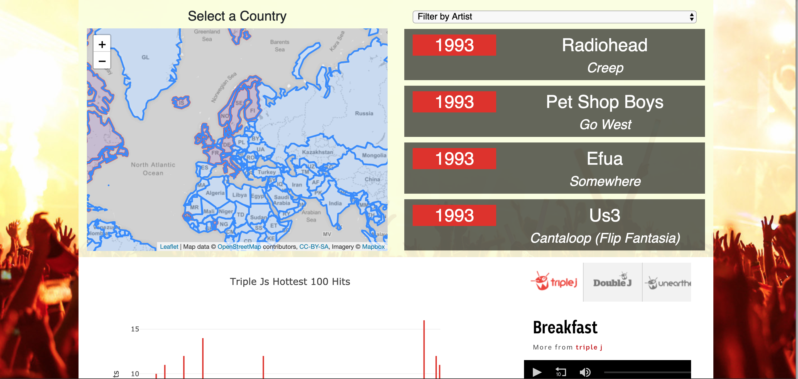
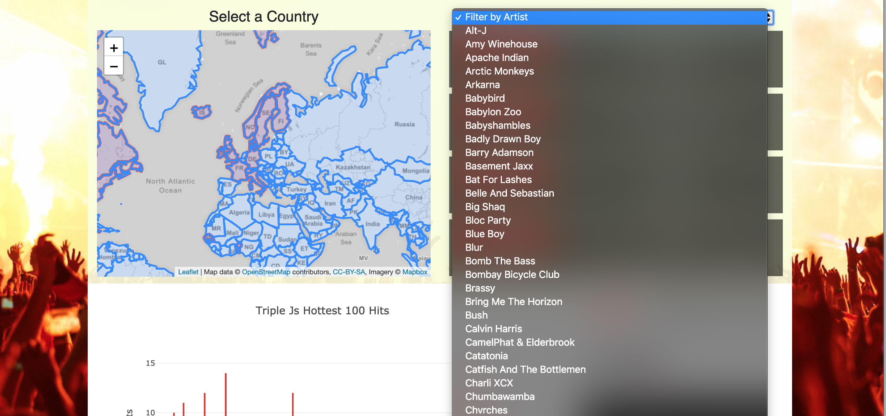
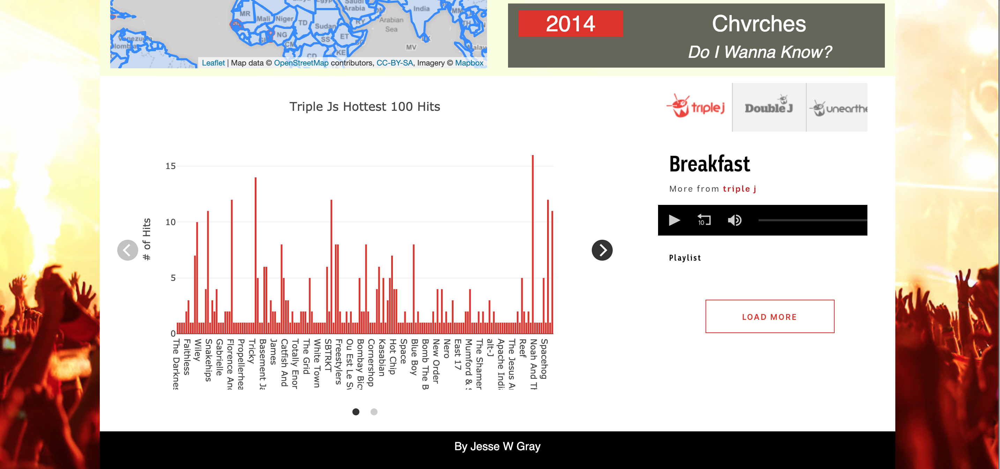
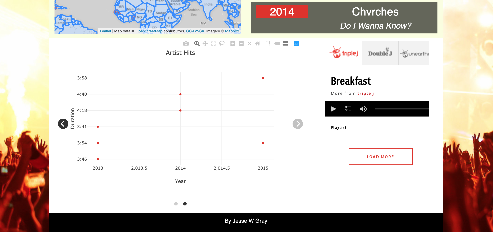

# musicFlaskApp

I used a csv of Triple J's past 'Hot 100' lists from 1993 - 2017 to create a database of songs and bands that had made the list over the years. The app charts and shows the data based on filters, created by clicking the map and dropdown options.

When you land on the page, you're able to select a country from the map. 

If there are songs on the list from that country, the dropdown will populate with bands, so you can filter by band. The right side of the page will populate with the artist and songs on the list and a chart will show below.

If you choose to filter by artist, the right side of the colum will update, as will the first bar graph, as well as a second chart showing the length of the charting songs.

